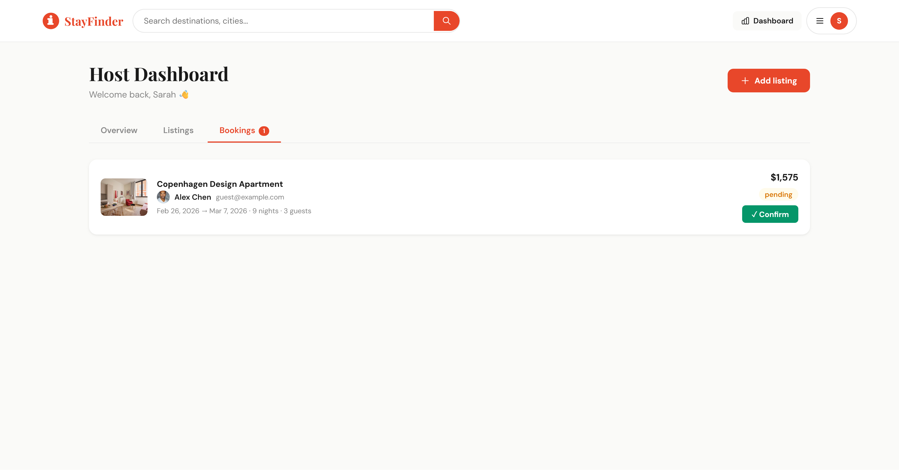
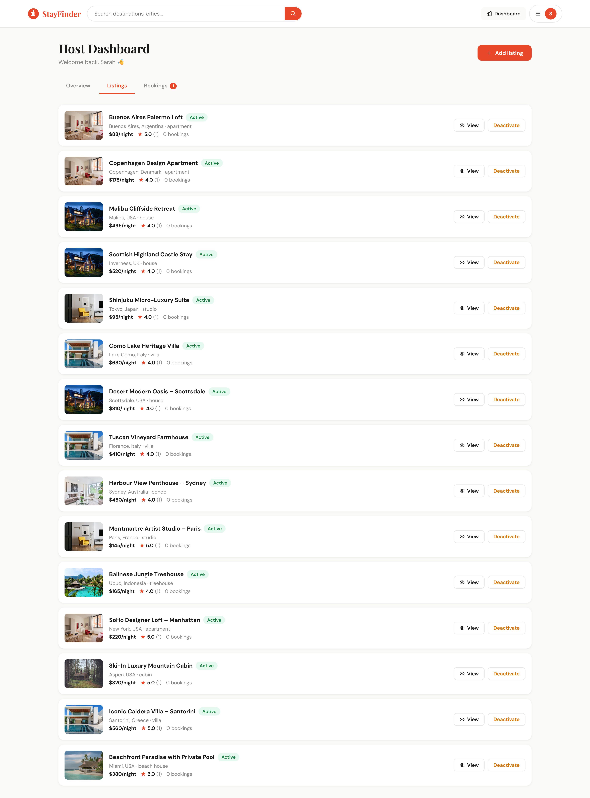
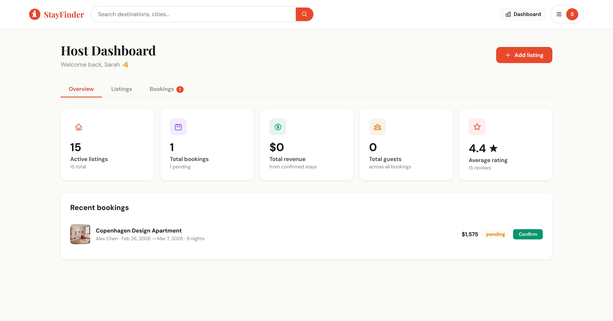
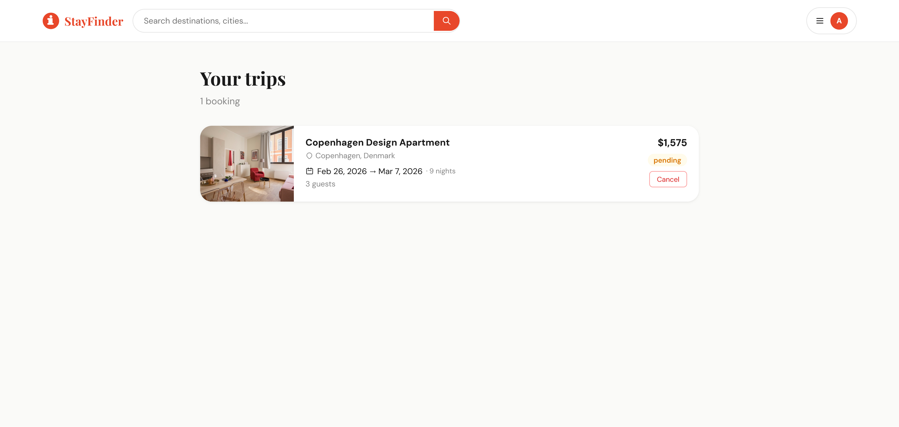
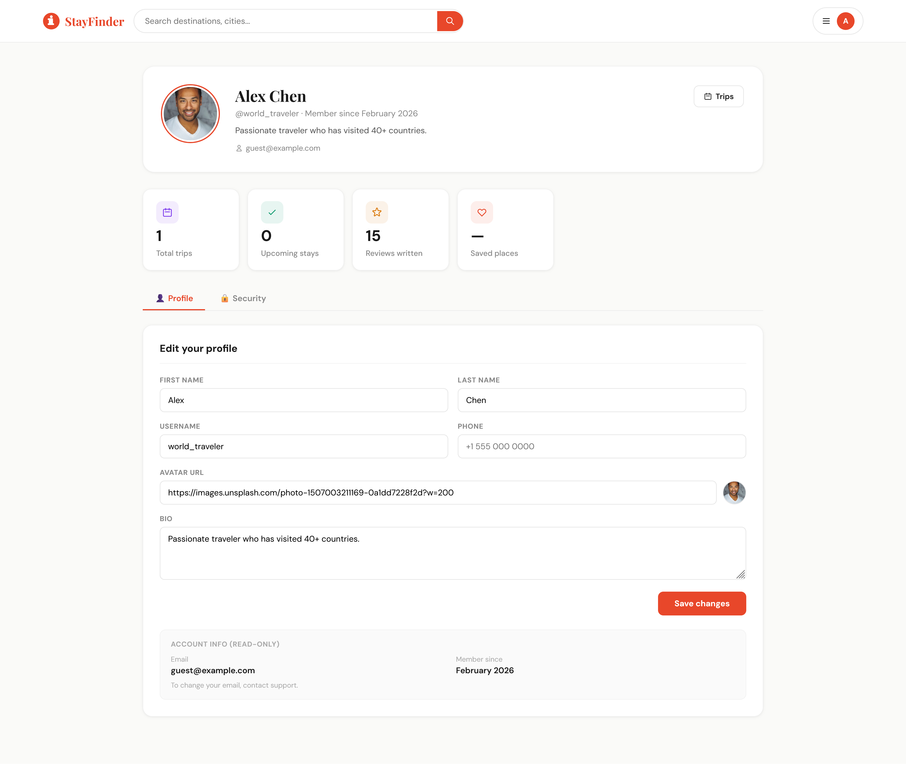
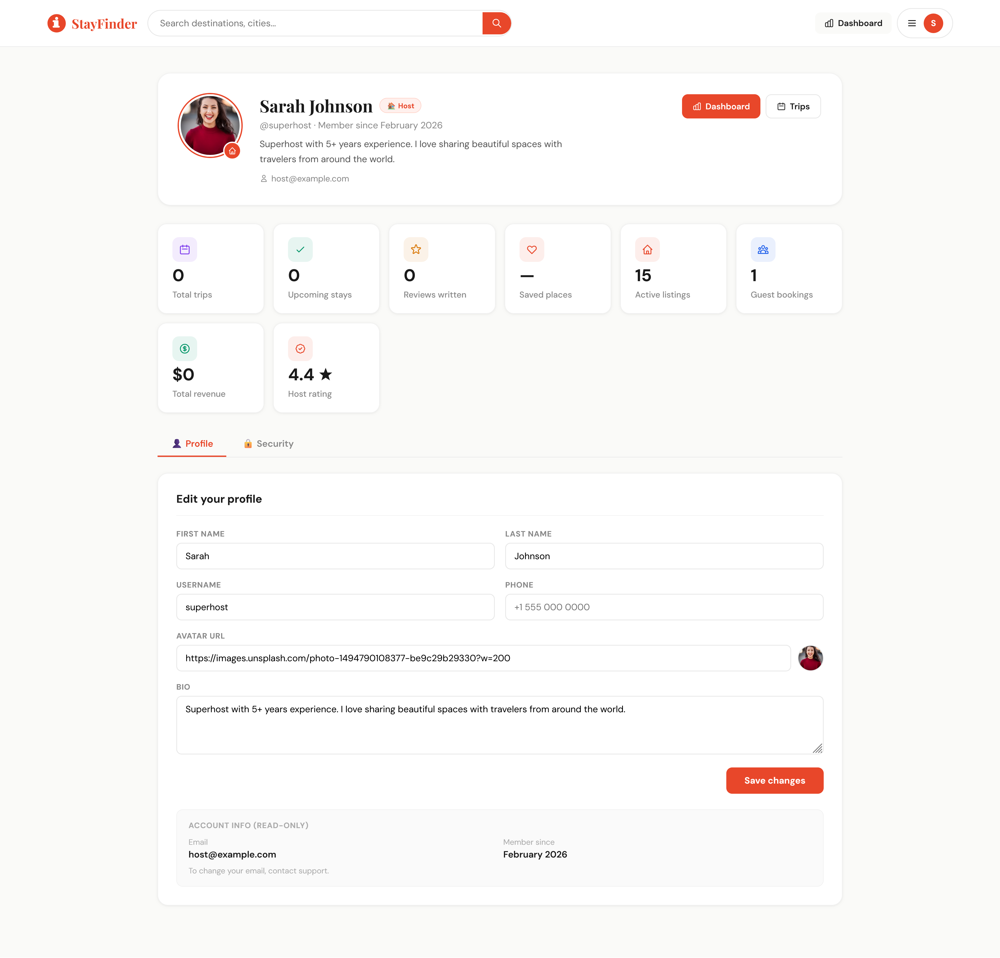

# 🏠 StayFinder — Airbnb Clone v2

A production-grade full-stack Airbnb clone with a **Django REST API** backend and a **React + Vite** frontend. Features separate Django apps per domain, Elasticsearch integration, OpenStreetMap, and a full host dashboard.

---

## ✨ What's New in v2

| Feature | Details |
|---------|---------|
| **Separated Django apps** | `accounts`, `listings`, `bookings`, `reviews`, `wishlists`, `search` |
| **Elasticsearch** | Full-text fuzzy search with auto-fallback to Django ORM |
| **OpenStreetMap** | Interactive map on listing detail pages (Leaflet.js) |
| **Host Dashboard** | Stats, manage listings, confirm/view bookings |
| **Multi-page React** | React Router — dedicated pages per section |
| **JWT Auth** | Access + refresh tokens (auto-refresh on 401) |
| **New Listing form** | Hosts can create listings from the UI |
| **Autocomplete** | City/country suggestions in search bar |
| **Sub-ratings** | Reviews now include cleanliness, accuracy, communication scores |

---

## 📸 Screenshots

> Screenshots are located in the `backend/screenshots/` folder.

### Home Page


### Property Details


### Host Booking List


### Host Listing List



### Host Dashboard



### My Trips



### Guest Profile



### Host Profile



## 🗂 Project Structure

```
airbnb-v2/
├── backend/
│   ├── config/               # Django config (settings, urls, wsgi)
│   ├── apps/
│   │   ├── accounts/         # Custom User model, JWT auth
│   │   ├── listings/         # Listing + Image models, host dashboard API
│   │   ├── bookings/         # Booking model, availability, confirm
│   │   ├── reviews/          # Review model with sub-ratings
│   │   ├── wishlists/        # Save/unsave listings
│   │   └── search/           # Elasticsearch document + search view
│   ├── manage.py
│   └── requirements.txt
│
└── frontend/
    ├── src/
    │   ├── pages/
    │   │   ├── HomePage.jsx          # Browse + filter listings
    │   │   ├── ListingDetailPage.jsx # Full detail, map, booking, reviews
    │   │   ├── HostDashboard.jsx     # Host stats + listing/booking mgmt
    │   │   ├── NewListingPage.jsx    # Create listing form
    │   │   └── TripsAndSaved.jsx     # My trips + wishlist
    │   ├── components/
    │   │   ├── Header.jsx
    │   │   ├── AuthModal.jsx
    │   │   ├── ListingCard.jsx
    │   │   ├── FilterBar.jsx
    │   │   ├── MapView.jsx           # Leaflet + OpenStreetMap
    │   │   └── UI.jsx                # Shared components
    │   ├── hooks/
    │   │   └── useAuth.jsx           # Auth context
    │   └── utils/
    │       └── api.js                # JWT-aware fetch + token refresh
    ├── index.html
    ├── package.json
    └── vite.config.js
```

---

## 🚀 Quick Start

### 1. Backend

```bash
cd backend

python -m venv venv
source venv/bin/activate       # Windows: venv\Scripts\activate

pip install -r requirements.txt

python manage.py makemigrations accounts listings bookings reviews wishlists
python manage.py migrate
python manage.py seed_data

python manage.py runserver
```

API: `http://localhost:8000`
Admin: `http://localhost:8000/admin`

### 2. Frontend

```bash
cd frontend
npm install
npm run dev
```

App: `http://localhost:3000`

---

## 🔐 Test Accounts

| Role  | Email                | Password    |
|-------|----------------------|-------------|
| Host  | host@example.com     | password123 |
| Guest | guest@example.com    | password123 |

---

## 🔍 Elasticsearch (optional)

The search API gracefully falls back to Django ORM if Elasticsearch is unavailable. To enable it:

```bash
# Install and start Elasticsearch 8.x
# macOS
brew install elastic/tap/elasticsearch-full
brew services start elasticsearch-full

# Or via Docker
docker run -p 9200:9200 -e "discovery.type=single-node" elasticsearch:8.11.0

# Index your data
python manage.py search_index --rebuild
```

---

## 📡 API Reference

### Auth — `/api/auth/`
| Method | Path | Description |
|--------|------|-------------|
| POST | `register/` | Create account → returns JWT tokens |
| POST | `login/` | Login → returns JWT tokens |
| POST | `token/refresh/` | Refresh access token |
| GET/PATCH | `profile/` | View or update own profile |

### Listings — `/api/listings/`
| Method | Path | Description |
|--------|------|-------------|
| GET | `/` | List all active listings (filterable) |
| POST | `/` | Create listing (auth required) |
| GET | `/{id}/` | Listing detail |
| PATCH | `/{id}/` | Update listing (host only) |
| DELETE | `/{id}/` | Delete listing (host only) |
| GET | `host/my-listings/` | Host's own listings |
| GET | `host/stats/` | Host dashboard stats |
| GET | `host/bookings/` | All bookings on host's listings |

### Search — `/api/search/`
| Method | Path | Description |
|--------|------|-------------|
| GET | `/` | Search listings (ES or ORM fallback) |
| GET | `autocomplete/?q=par` | City/country autocomplete |

**Query params**: `q`, `property_type`, `city`, `country`, `min_price`, `max_price`, `min_guests`, `min_bedrooms`, `has_wifi`, `has_pool`, `has_kitchen`, `has_parking`, `has_ac`, `has_gym`, `ordering`, `page`

### Bookings — `/api/bookings/`
| Method | Path | Description |
|--------|------|-------------|
| GET | `/` | My bookings |
| POST | `/` | Create booking |
| POST | `/{id}/cancel/` | Cancel booking (guest) |
| POST | `/{id}/confirm/` | Confirm booking (host) |
| GET | `availability/{listing_id}/` | Get booked date ranges |

### Reviews — `/api/reviews/`
| Method | Path | Description |
|--------|------|-------------|
| GET | `listings/{id}/reviews/` | Get listing reviews |
| POST | `listings/{id}/reviews/` | Post review |

### Wishlists — `/api/wishlists/`
| Method | Path | Description |
|--------|------|-------------|
| GET | `saved/` | Get saved listings |
| GET | `saved/ids/` | Get saved listing IDs |
| POST | `toggle/{id}/` | Toggle save |

---

## 🛠 Tech Stack

**Backend**
- Django 4.2 + DRF
- JWT via `djangorestframework-simplejwt`
- Elasticsearch 8 via `django-elasticsearch-dsl`
- SQLite (dev), PostgreSQL-ready (prod)
- 6 separate Django apps

**Frontend**
- React 18 + Vite
- React Router v6 (multi-page)
- Leaflet + react-leaflet + OpenStreetMap
- DM Sans + Playfair Display fonts
- Zero CSS framework — custom design system

---

## 🔧 Production Checklist

- [ ] Set `SECRET_KEY` via env var
- [ ] Set `DEBUG=False`
- [ ] Switch to PostgreSQL
- [ ] Configure media storage (S3/Cloudinary)
- [ ] Run `collectstatic`
- [ ] Update `CORS_ALLOWED_ORIGINS`
- [ ] Deploy Elasticsearch cluster
- [ ] Use Gunicorn + Nginx
#   S t a y F i n d e r 
 
 
